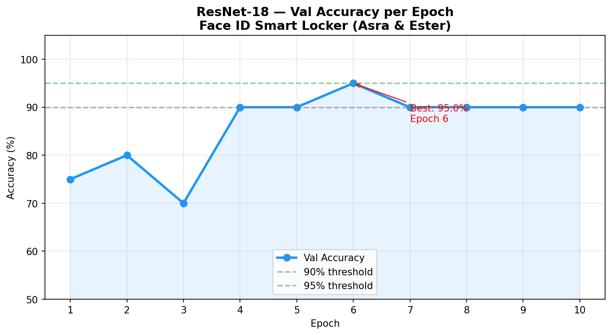
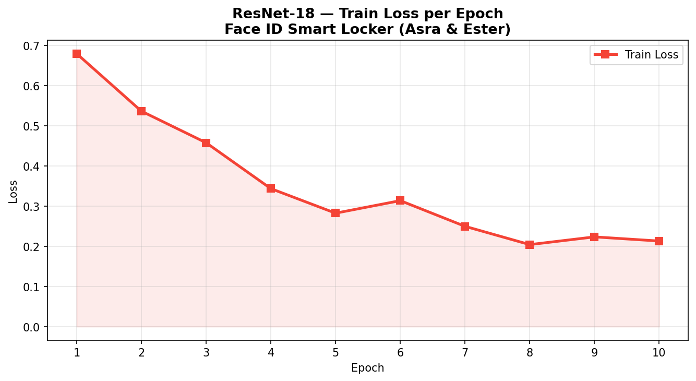

# AIoT Smart Locker — ResNet-18 Face ID

**RET503 · Pertemuan 3 · [Asra Devi Fanitya] · [4222401020]**

---

## Deskripsi Proyek

Proyek ini merupakan eksperimen modul Face ID untuk sistem AIoT Smart Locker menggunakan model ResNet-18. Model digunakan untuk mengklasifikasikan wajah pengguna terdaftar ke dalam dua kelas, yaitu Asra dan Ester.

Eksperimen ini dilakukan untuk melihat performa transfer learning ResNet-18 dalam melakukan klasifikasi wajah serta mengukur waktu inference pada CPU, sebagai bagian dari perbandingan tiga arsitektur (ResNet-18, ResNet-50, EfficientNet-B0) dalam kelompok.

---

## Dataset

Dataset utama terdiri dari 100 gambar wajah:

| Kelas | Jumlah |
|---|---|
| Asra | 50 |
| Ester | 50 |
| **Total** | **100** |

> Pada `metadata.csv` juga terdapat data `ali` sebanyak 3 gambar dan `unknown` sebanyak 1 gambar. Data tersebut tidak digunakan dalam eksperimen utama.

---

## Pembagian Dataset

Asra dan Ester hanya memiliki satu sesi pengambilan data (sesi1), sehingga pembagian berdasarkan sesi tidak dapat dilakukan.

Eksperimen menggunakan random split 80:20 dengan seed=42.

| Dataset | Asra | Ester | Total |
|---|---|---|---|
| Training | 40 | 40 | 80 |
| Validation | 10 | 10 | 20 |

---

## Pipeline Preprocessing

```
Gambar
  ↓
Convert BGR → RGB
  ↓
Random Horizontal Flip + Color Jitter (train) / Center Crop (val)
  ↓
Resize 224 × 224
  ↓
ToTensor
  ↓
Normalize ImageNet
```

Parameter normalisasi:
```
mean = [0.485, 0.456, 0.406]
std  = [0.229, 0.224, 0.225]
```

---

## Model ResNet-18

Model yang digunakan adalah ResNet-18 pretrained ImageNet. Backbone dibekukan (feature extraction), hanya fully connected layer terakhir yang dilatih ulang dengan 2 output kelas:
```
0 → Asra
1 → Ester
```

| Parameter | Nilai |
|---|---|
| Model | ResNet-18 |
| Pretrained | ImageNet |
| Strategi TL | Feature extraction (backbone beku) |
| Jumlah kelas | 2 |
| Batch size | 16 |
| Epoch | 10 |
| Learning rate | 0.001 |
| Optimizer | Adam |
| Scheduler | CosineAnnealingLR |
| Loss function | Cross Entropy Loss |
| Device | CPU |

---

## Struktur Folder

```
ResNet18/
├── dataset_raw/              # Dataset lokal, tidak di-upload ke GitHub
│   ├── metadata.csv
│   ├── Asra/
│   └── Ester/
├── scripts/
│   ├── capture.py
│   ├── split.py
│   ├── train.py
│   └── latency.py
├── results/
│   ├── training_results.csv
│   ├── loss_plot_resnet18.png
│   └── accuracy_plot_resnet18.png
├── .gitignore
├── requirements.txt
└── README.md
```

> File model `best_resnet18.pth` tidak di-upload ke repository karena ukurannya besar.

---

## Instalasi

```bash
python -m pip install -r requirements.txt
```

---

## Persiapan Dataset

Dataset tidak disertakan dalam repository karena berisi foto wajah. Struktur dataset lokal:

```
dataset_raw/
├── metadata.csv
├── Asra/
└── Ester/
```

Pengambilan data menggunakan `capture.py` dengan kamera Windows Hello USB (1920×1080, FOV 95°) dan detektor wajah YuNet.

---

## Training ResNet-18

```bash
python scripts/train.py --model resnet18
```

Program akan:
1. Membaca `dataset_split/train` dan `dataset_split/val`
2. Memuat ResNet-18 pretrained ImageNet
3. Membekukan backbone, melatih hanya fc layer
4. Melatih model selama 10 epoch
5. Menyimpan hasil training ke `results/`

---

## Pengukuran Latency

```bash
python scripts/latency.py
```

Pengukuran dilakukan pada CPU dengan 100 runs setelah warm-up.

---

## Hasil Eksperimen

| Parameter | Hasil |
|---|---|
| Model | ResNet-18 |
| Jumlah kelas | 2 |
| Total dataset | 100 gambar |
| Training | 80 gambar |
| Validation | 20 gambar |
| Epoch | 10 |
| Akurasi validation terbaik | **95.00%** |
| Epoch terbaik | 6 |
| Epoch pertama @ 90% | 4 |
| Waktu training | ±1.0 menit |
| Average latency | 59.92 ms |
| Minimum latency | 47.30 ms |
| Maximum latency | 138.50 ms |
| FPS estimasi | 16.7 FPS |

### Grafik Accuracy


### Grafik Loss


---

## Analisis Hasil

ResNet-18 memperoleh akurasi validation terbaik sebesar **95%** pada epoch ke-6. Model pertama kali mencapai 90% pada epoch ke-4, menunjukkan konvergensi yang stabil dibanding model yang lebih besar.

Kurva training menunjukkan loss yang konsisten turun tanpa lonjakan drastis — berbeda dengan ResNet-50 (anggota tim lain) yang sempat drop ke 60% di epoch ke-4. Stabilitas ini menjadi keunggulan ResNet-18 untuk dataset kecil.

Dari sisi latensi, ResNet-18 membutuhkan rata-rata **59.92 ms per frame** (16.7 FPS) di CPU laptop. Nilai ini memenuhi target minimum 10 FPS untuk sistem smart locker.

---

## Perbandingan dengan Model Lain (Kelompok)

| Model | Best Val Acc | Waktu Latih | Epoch @ 90% | Avg Latency |
|---|---|---|---|---|
| **ResNet-18 (saya)** | 95.00% | 1.0 menit | 4 | 59.92 ms |
| ResNet-50 | 100.00% | 2.2 menit | 3 | - |
| EfficientNet-B0 | 100.00% | 1.5 menit | 2 | 56.40 ms |

ResNet-18 memiliki akurasi lebih rendah namun kurva training paling stabil. EfficientNet-B0 unggul di akurasi dan efisiensi model, sementara ResNet-50 paling akurat namun paling berat.

---

## Keterbatasan Eksperimen

1. Dataset hanya terdiri dari 100 gambar (50/kelas)
2. Hanya satu sesi pengambilan data — train dan val dari kondisi yang sama
3. Hanya 2 kelas — belum representatif untuk deployment 13 pengguna
4. Pengujian latency dilakukan di CPU laptop, bukan perangkat final (Mini PC)
5. Belum ada pengujian dengan wajah orang yang tidak terdaftar

Eksperimen berikutnya dapat menggunakan dataset lebih besar, beberapa sesi pengambilan, kondisi pencahayaan beragam, dan pengujian di Mini PC yang menjadi perangkat target.

---

## Catatan

Eksperimen ini berfokus pada klasifikasi dua wajah terdaftar menggunakan ResNet-18 sebagai bagian dari pengembangan modul Face ID pada sistem AIoT Smart Locker. Dataset foto wajah dan file model hasil training tidak disertakan dalam repository untuk menjaga privasi dan menghindari penyimpanan file berukuran besar.

---

*Program Studi Teknologi Rekayasa Robotika · Politeknik Negeri Batam*
